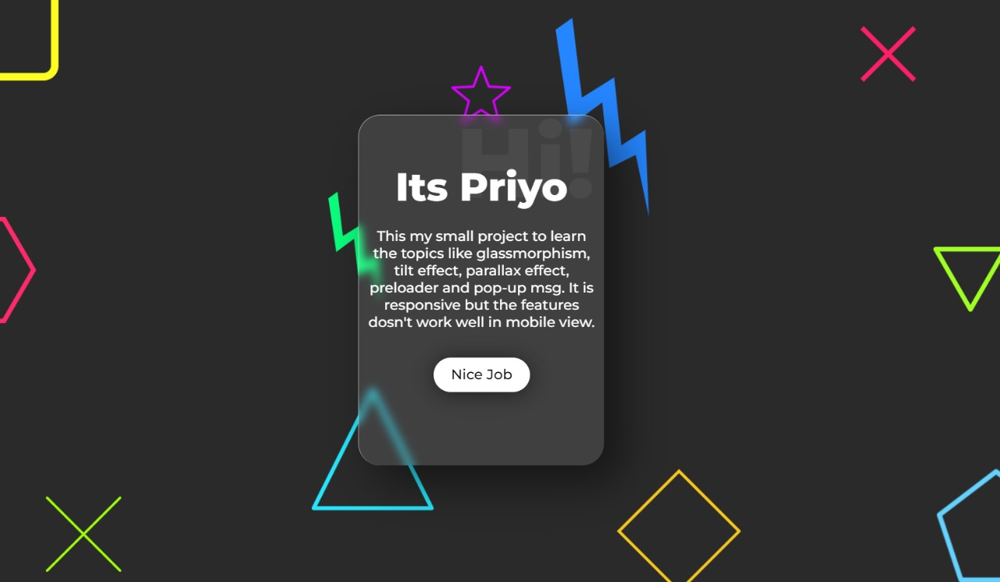

<!-- 
** Thanks for checking out my readme file. If you think adding anymore to this readme will make the readme more good then please do make suggestion.

** simply open an issue with the tag "enhancement" and say what i need to add or change.

** Don't forget to give the project a star!

** Thanks again! now make something AMAZING! :D
 -->

# Basic-CSS-designing
 Learning some of the important basics of CSS and JS, such as: parallax effect, glassmorphism, card tilt effect and preloader. This project is actually made to learn and understand some basic features in CSS. So, not much is given here.

 

    <a href="https://basic-css-designing.netlify.app/">View Demo</a>
    ·
    <a href="https://github.com/PriyoRaven/Basic-CSS-designing/issues">Report Bug</a>
    ·
    <a href="https://github.com/PriyoRaven/Basic-CSS-designing/issues">Request Feature</a>
  

 
 # Project-Screenshot
 

## Built With

This section should list any major frameworks/libraries used to bootstrap your project. Leave any add-ons/plugins for the acknowledgements section. Here are a few examples.

* 
* 
* <a href="https://developer.mozilla.org/en-US/docs/Web/JavaScript" target="_blank"> 

 
 ## Contact

- priyadarsi02@gmail.com

Project Link: [https://github.com/PriyoRaven/Basic-CSS-designing](https://github.com/PriyoRaven/Basic-CSS-designing)

(<a href="#readme-top">back to top</a>)

